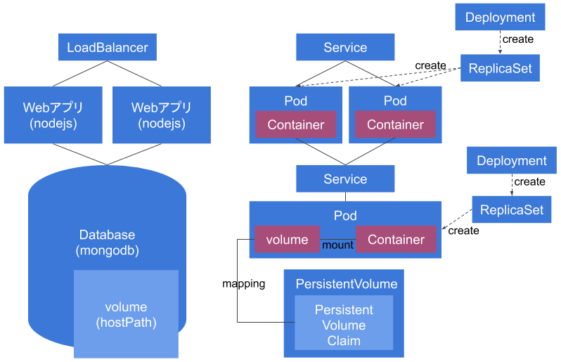

# README

## はじめに

本プロジェクトは下記資料向けに作成したサンプルアプリです。

https://docs.google.com/presentation/d/e/2PACX-1vQEFmAFyslw29r_20izfO_aUWH_vUG4oJ5LYi8jgBqjaSTXQor0yt1uaywCGP6DvLir4nisYXyYskKT/pub?start=false&loop=false&delayms=1000

本アプリを利用する際は、上記スライドを参照してからの方がより理解しやすいと思います。

## アプリの仕様と構成



### 仕様と構成

* 顧客情報を登録して一覧表示できるWebアプリ
* Webアプリはnodejs(express)、DBはmongodb
* Webアプリは高可用性/負荷分散のため2台構成
* DBのデータはマシン上のHDDに永続化(NFSとか使ってない)

###  その他

* WebアプリのデプロイではRolling Update(無停止更新)が試せる

## デプロイ手順

アプリのデプロイ手順について説明します。

### DBのデプロイ

1. Volumeの作成  
PersistentVolumeとPersistentVolumeClaimの作成
1. Databaseのデプロイ  
Deploymentの作成してReplicaSetとPodを生成する
1. Databaseのエンドポイント(ネットワーク経路)作成  
Serviceの作成

#### Volumeの作成

下記のコマンドを実行してVolumeを作成します。

```
$ kubectl apply -f https://raw.githubusercontent.com/yasuhirosawabe/sample-app-for-kube-deploy/master/deploy/db/volume.yaml
```

作成に成功すると、下記のコマンドで「PersistentVolume」と「PersistentVolumeClaim」が作成されていることが確認できます。

```
$ kubectl get pv
NAME      CAPACITY   ACCESS MODES   RECLAIM POLICY   STATUS    CLAIM        STORAGECLASS   REASON    AGE
db        10Gi       RWO            Delete           Bound     default/db   hostpath                 1d
```

```
$ kubectl get pvc
NAME      STATUS    VOLUME    CAPACITY   ACCESS MODES   STORAGECLASS   AGE
db        Bound     db        10Gi       RWO            hostpath       1d
```

上が「PersistentVolume」下が「PersistentVolumeClaim」になります。

「PersistentVolume」では「hostpath(マシンのHDD上)」に10GBのストレージ領域を確保し、  
「PersistentVolumeClaim」で上記10GBのストレージ領域のうち、10GB(すべての領域)を「Pod」の「Volume」として利用できるよう確保(要求)しています。


#### Databaseのデプロイ

下記のコマンドでDatabaseをデプロイします。

```
$ kubectl apply -f https://raw.githubusercontent.com/yasuhirosawabe/sample-app-for-kube-deploy/master/deploy/db/deployment.yaml
```

デプロイすると、「Deployment」「ReplicaSet」「Pod」がそれぞれ１つずつ作成されます。作成されたかどうかは下記のコマンドで確認することができます。

```
$ kubectl get all
NAME                       READY     STATUS    RESTARTS   AGE
pod/db-7dbc64fdd5-cbmsf    1/1       Running   0          1d

NAME                 TYPE           CLUSTER-IP      EXTERNAL-IP   PORT(S)          AGE
service/kubernetes   ClusterIP      10.96.0.1       <none>        443/TCP          1d

NAME                  DESIRED   CURRENT   UP-TO-DATE   AVAILABLE   AGE
deployment.apps/db    1         1         1            1           1d

NAME                             DESIRED   CURRENT   READY     AGE
replicaset.apps/db-7dbc64fdd5    1         1         1         1d
```

Deployment「db」、ReplicaSet「db-7dbc64fdd5」、Pod「db-7dbc64fdd5-cbmsf」が作成されているのがわかります。

なお、上記Pod内では、先ほど作った「PersistentVolumeClaim」と「Volume」の紐づけが行われています。  
紐づけの定義ですが「Deployment」で行われています。マニフェストファイル(deployment.yaml)でいうとちょうど下記にあたります。


```yaml
volumes:
- name: mongo-db
  persistentVolumeClaim:
    claimName: db
```

これにより「Pod」内に「mongo-db」という「Volume」が作られ、

```yaml
containers:
- name: mongo
(...中略...)
volumeMounts:
- name: mongo-db
    mountPath: /data/db
```

上記定義により「Pod」内の「mongo」というコンテナの「/data/db」にマウントしています。

これらにより、Databaseのデータが永続化されます。


#### Databaseのエンドポイント(ネットワーク経路)作成

下記のコマンドで他の「Pod」からDatabaseの「Pod」に参照できるようエンドポイントを作成します。

```
$ kubectl apply -f https://raw.githubusercontent.com/yasuhirosawabe/sample-app-for-kube-deploy/master/deploy/db/service.yaml
```


```
$ kubectl get all
NAME                       READY     STATUS    RESTARTS   AGE
pod/db-7dbc64fdd5-cbmsf    1/1       Running   0          1d

NAME                 TYPE           CLUSTER-IP      EXTERNAL-IP   PORT(S)          AGE
service/db           ClusterIP      10.96.78.37     <none>        27017/TCP        1d
service/kubernetes   ClusterIP      10.96.0.1       <none>        443/TCP          1d

NAME                  DESIRED   CURRENT   UP-TO-DATE   AVAILABLE   AGE
deployment.apps/db    1         1         1            1           1d

NAME                             DESIRED   CURRENT   READY     AGE
replicaset.apps/db-7dbc64fdd5    1         1         1         1d
```

Service「db」が作成されているのがわかります。

なお、他の「Pod」からアクセスする場合は「db」というホスト名でアクセスすることができるようになります。


### WEBのデプロイ

DBのデプロイとは「Volume」の作成がないだけで、大きく違いはないので詳細な説明は省きます。  
下記のコマンドで「Deployment」と「Service」を作成します。

```
$ kubectl apply -f https://raw.githubusercontent.com/yasuhirosawabe/sample-app-for-kube-deploy/master/deploy/web/deployment.yaml
$ kubectl apply -f https://raw.githubusercontent.com/yasuhirosawabe/sample-app-for-kube-deploy/master/deploy/web/service.yaml
```

```
$ kubectl get all
NAME                       READY     STATUS    RESTARTS   AGE
pod/db-7dbc64fdd5-cbmsf    1/1       Running   0          1d
pod/web-5674b7d8d6-vhpmx   1/1       Running   0          1d
pod/web-5674b7d8d6-xv2td   1/1       Running   0          1d

NAME                 TYPE           CLUSTER-IP      EXTERNAL-IP   PORT(S)          AGE
service/db           ClusterIP      10.96.78.37     <none>        27017/TCP        1d
service/kubernetes   ClusterIP      10.96.0.1       <none>        443/TCP          1d
service/web          LoadBalancer   10.109.33.168   localhost     3000:32416/TCP   1d

NAME                  DESIRED   CURRENT   UP-TO-DATE   AVAILABLE   AGE
deployment.apps/db    1         1         1            1           1d
deployment.apps/web   2         2         2            2           1d

NAME                             DESIRED   CURRENT   READY     AGE
replicaset.apps/db-7dbc64fdd5    1         1         1         1d
replicaset.apps/web-5674b7d8d6   2         2         2         1d
```

Deployment「web」とReplicaSet「web-5674b7d8d6」が作成され、replica数を２つに指定しているのでPodが「web-5674b7d8d6-vhpmx」と「web-5674b7d8d6-xv2td」の２つ作成されているのがわかります。

また、Service「web」も作成されているのがわかります。ここで注目すべきは「Service」のTypeが「LoadBalancer」になっている点です。

「ClusterIP」の場合はK8sクラスタ内で公開できるようネットワークが構成されますが、「LoadBalancer」の場合はクラスタ外部からアクセスできるようになります。

```
http://localhost:3000
```

でアプリにアクセスすることができます。


## Rolling Update(無停止更新)

ターミナルを２つ開いて、１つ目のターミナル上で下記のコマンドを実行してください。

```
$ while true; do kubectl get all; echo "----end----"; sleep 1; done;
```

上記コマンドを実行することで「kubectl get all」を１秒おきに表示しつづけることができます。

次に、２つ目のターミナルで下記のコマンドを実行します。

```
# kubectl apply -f https://raw.githubusercontent.com/yasuhirosawabe/sample-app-for-kube-deploy/master/deploy/web/deployment-update.yaml
```

上記「deployment-update.yaml」では「deployment.yaml」からImageのTagを変更しています。

```yaml
image: usalab/kube-app-demo-web:0.0.1
  ↓↓↓変更↓↓↓
image: usalab/kube-app-demo-web:0.0.2
```

この変更をKubernetesが検知することでRolling Updateが走ります。  
その様子は１つ目のターミナルを観察しているとわかります。

```
NAME                       READY     STATUS              RESTARTS   AGE
pod/db-7dbc64fdd5-cbmsf    1/1       Running             0          1d
pod/web-5674b7d8d6-g56fb   1/1       Running             0          1d
pod/web-5674b7d8d6-m7768   1/1       Running             0          1d
pod/web-6cbccb5c8c-xv2td   0/1       ContainerCreating   0          1s

NAME                 TYPE           CLUSTER-IP      EXTERNAL-IP   PORT(S)          AGE
service/db           ClusterIP      10.96.78.37     <none>        27017/TCP        1d
service/kubernetes   ClusterIP      10.96.0.1       <none>        443/TCP          1d
service/web          LoadBalancer   10.109.33.168   localhost     3000:32416/TCP   1d

NAME                  DESIRED   CURRENT   UP-TO-DATE   AVAILABLE   AGE
deployment.apps/db    1         1         1            1           1d
deployment.apps/web   2         3         1            2           1d

NAME                             DESIRED   CURRENT   READY     AGE
replicaset.apps/db-7dbc64fdd5    1         1         1         1d
replicaset.apps/web-5674b7d8d6   2         2         2         1d
replicaset.apps/web-6cbccb5c8c   1         1         0         1s
```

Rolling Updateが開始されるとDeployment「web」は新しいReplicaSet「web-6cbccb5c8c」を作成します。  
ReplicaSet「web-6cbccb5c8c」は、まず、「DESIRED = 1」で新しいPod「web-6cbccb5c8c-xv2td」の作成を要求します。

```
NAME                       READY     STATUS              RESTARTS   AGE
pod/db-7dbc64fdd5-cbmsf    1/1       Running             0          1d
pod/web-5674b7d8d6-g56fb   1/1       Running             0          1d
pod/web-5674b7d8d6-m7768   1/1       Terminating         0          1d
pod/web-6cbccb5c8c-vhpmx   0/1       ContainerCreating   0          1s
pod/web-6cbccb5c8c-xv2td   1/1       Running             0          24s

NAME                 TYPE           CLUSTER-IP      EXTERNAL-IP   PORT(S)          AGE
service/db           ClusterIP      10.96.78.37     <none>        27017/TCP        1d
service/kubernetes   ClusterIP      10.96.0.1       <none>        443/TCP          1d
service/web          LoadBalancer   10.109.33.168   localhost     3000:32416/TCP   1d

NAME                  DESIRED   CURRENT   UP-TO-DATE   AVAILABLE   AGE
deployment.apps/db    1         1         1            1           1d
deployment.apps/web   2         3         2            2           1d

NAME                             DESIRED   CURRENT   READY     AGE
replicaset.apps/db-7dbc64fdd5    1         1         1         1d
replicaset.apps/web-5674b7d8d6   1         1         1         1d
replicaset.apps/web-6cbccb5c8c   2         2         1         24s
```

Pod「web-6cbccb5c8c-xv2td」がRunning状態になると、Deployment「web」は２つPodが立ち上がっていることを維持しようとするので、ReplicaSet「web-5674b7d8d6」の「DESIRED」を「1」にしてPodを１つ削除しようとします。  
ReplicaSetの「DESIRED」数が減ることでPod「web-5674b7d8d6-m7768」がTerminating(削除中)状態になり、旧バージョンのPodが１つ削除されます。

また、それと並行して、新しいバージョンのPodをさらに作成するためReplicaSet「web-6cbccb5c8c」の「DESIRED」を「2」にしてPod「web-6cbccb5c8c-vhpmx」が作成されるようにします。

このようにReplicaSetの「DESIRED」を調整することで、少しずつ新しいバージョンにアップデート(Rolling Update)していきます。

```
NAME                       READY     STATUS        RESTARTS   AGE
pod/db-7dbc64fdd5-cbmsf    1/1       Running       0          1d
pod/web-6cbccb5c8c-vhpmx   1/1       Running       0          33s
pod/web-6cbccb5c8c-xv2td   1/1       Running       0          57s

NAME                 TYPE           CLUSTER-IP      EXTERNAL-IP   PORT(S)          AGE
service/db           ClusterIP      10.96.78.37     <none>        27017/TCP        1d
service/kubernetes   ClusterIP      10.96.0.1       <none>        443/TCP          1d
service/web          LoadBalancer   10.109.33.168   localhost     3000:32416/TCP   1d

NAME                  DESIRED   CURRENT   UP-TO-DATE   AVAILABLE   AGE
deployment.apps/db    1         1         1            1           1d
deployment.apps/web   2         2         2            2           1d

NAME                             DESIRED   CURRENT   READY     AGE
replicaset.apps/db-7dbc64fdd5    1         1         1         1d
replicaset.apps/web-5674b7d8d6   0         0         0         1d
replicaset.apps/web-6cbccb5c8c   2         2         2         57s
```

最終的に上記のように新しいバージョンのPod２つが立ち上がるようにします。


## DBとWEBの削除

デプロイしたものを削除します。削除する場合は下記のコマンドを実行してください。

```
$ kubectl delete service db web
$ kubectl delete deployment db web
$ kubectl delete pvc db
$ kubectl delete pv db
```